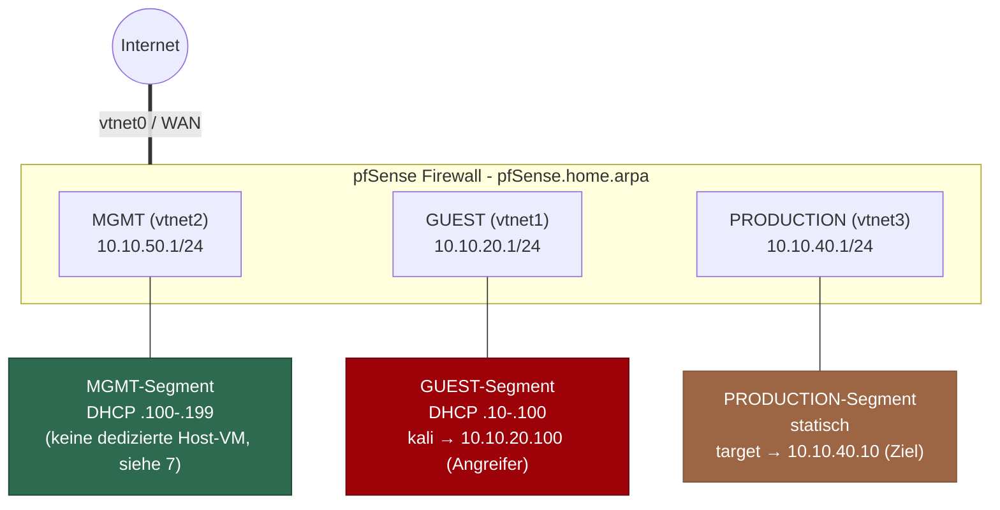
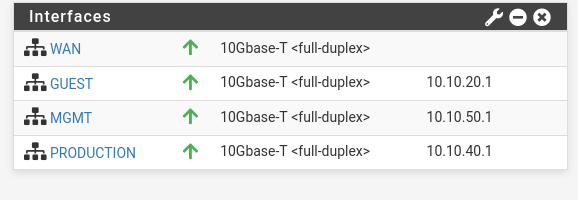
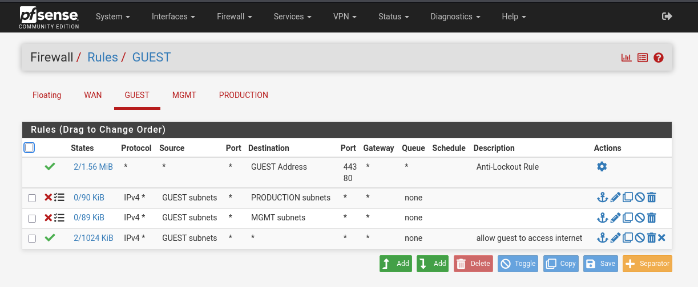
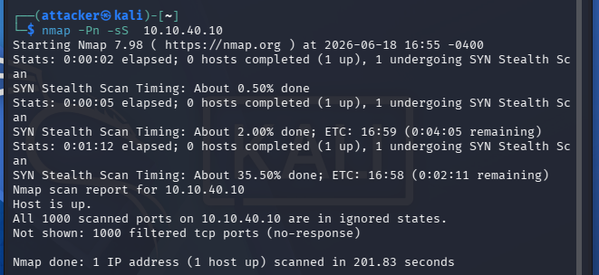
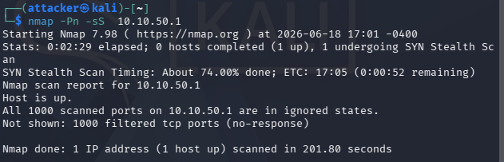
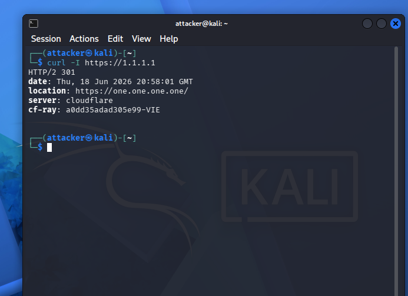
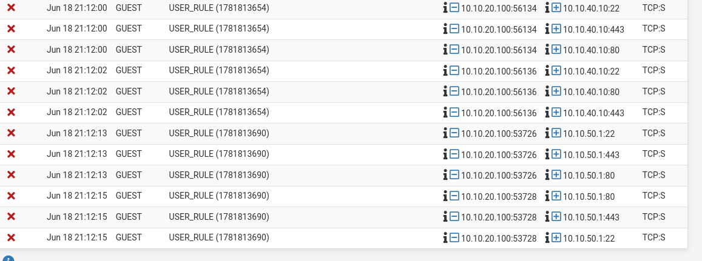
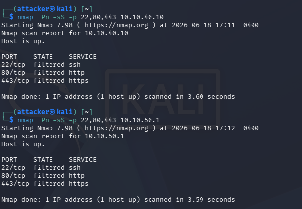

# Netzwerk-Segmentierung mit pfSense

Aufbau und Verifikation einer segmentierten Netzwerkarchitektur mit pfSense (Community Edition) in einer virtualisierten Lab-Umgebung. Ziel: Lateral Movement zwischen Sicherheitszonen unterbinden und das Verhalten per aktivem Test aus Angreifer- *und* Verteidigersicht nachweisen.

> Status: Arbeitsprobe / Lab-Dokumentation. Reiner Aufbau- und Verifikationsnachweis, keine Nachbauanleitung.

## Ergebnis auf einen Blick

Drei Sicherheitszonen (GUEST / PRODUCTION / MGMT) auf dedizierten pfSense-Interfaces, verifiziert durch aktiven Test:

- **GUEST → PRODUCTION:** nachweislich `filtered` (1000 Ports, silent drop) - Lateral Movement unterbunden.
- **GUEST → MGMT:** nachweislich `filtered` - Management-Netz aus dem Untrusted-Segment nicht erreichbar.
- **GUEST → Internet:** funktioniert - die Policy blockt gezielt intern, ohne legitime Konnektivität zu brechen.
- **Defender-Sicht:** beide Blocks im Firewall-Log mit Quelle, Ziel und Port belegt.
- **Eigenes Finding:** Webconfigurator aus GUEST erreichbar - dokumentiert mit Risikobewertung und Remediation (siehe [7](#7-findings--bekannte-limitierungen)).

---

## 1. Ziel & Threat Model

Drei Zonen mit unterschiedlichem Vertrauensniveau, getrennt über dedizierte pfSense-Interfaces:

| Zone | Vertrauen | Zweck |
|---|---|---|
| **MGMT** | hoch | Administrativer Zugriff (Jump-/Admin-Netz), darf alles erreichen |
| **PRODUCTION** | mittel | Schützenswerte Systeme, vollständig isoliert |
| **GUEST** | niedrig | Untrusted Clients, nur Internet, kein internes Ziel |

Angenommene Bedrohung: Ein kompromittierter Client im GUEST-Netz versucht, lateral auf PRODUCTION oder MGMT zuzugreifen (z. B. Recon per Portscan, anschließend Exploitation). Die Segmentierung muss diesen Pfad unterbinden, ohne den legitimen Internetzugang von GUEST zu beeinträchtigen.

---

## 2. Topologie



Virtualisierung: KVM/QEMU (libvirt, `qemu:///system`) auf Arch-Linux-Host. Jedes Segment ist ein eigenes isoliertes libvirt-Netz; pfSense terminiert alle Segmente als Router/Firewall.

---

## 3. Interface- & IP-Plan

| Interface | NIC | MAC | Zone | IPv4 |
|---|---|---|---|---|
| WAN | vtnet0 | 52:54:00:04:ba:39 | Uplink | DHCP vom Upstream |
| GUEST | vtnet1 | 52:54:00:b0:d0:a1 | niedrig | 10.10.20.1/24 |
| MGMT | vtnet2 | 52:54:00:77:34:30 | hoch | 10.10.50.1/24 |
| PRODUCTION | vtnet3 | 52:54:00:8a:f7:0f | mittel | 10.10.40.1/24 |




## 4. DHCP

| Zone | Subnet | Pool |
|---|---|---|
| GUEST | 10.10.20.0/24 | 10.10.20.10 – 10.10.20.100 |
| MGMT | 10.10.50.0/24 | 10.10.50.100 – 10.10.50.199 |
| PRODUCTION | 10.10.40.0/24 | 10.10.40.10 – 10.10.40.100 |

Hosts: `kali` → 10.10.20.100 (GUEST, DHCP). `target` → 10.10.40.10 (PRODUCTION, statisch konfiguriert - ein passives Ziel braucht keine dynamische Adresse).

---

## 5. Firewall-Policy

pfSense wertet Regeln pro Interface **first-match, top-down** aus. Spezifische Blocks stehen daher **vor** der generellen Allow-Regel - sonst würde die Allow-Any-Regel zuerst greifen und die Blocks würden nie erreicht.

### Soll-Matrix

| Quelle ↓ \ Ziel → | MGMT | GUEST | PRODUCTION | Internet |
|---|---|---|---|---|
| **MGMT** | – | allow | allow | allow |
| **GUEST** | **block** | – | **block** | allow |
| **PRODUCTION** | deny\* | deny\* | – | deny\* |

\* PRODUCTION hat **keine** Pass-Regeln → es greift der Implicit Deny von pfSense. PRODUCTION-Hosts können **keine** Verbindung initiieren (auch nicht ins Internet). Das ist hier **bewusst** so gewählt, weil das Target passiv ist und keine Dienste nach außen braucht. In einem echten Produktivnetz wäre mindestens ausgehender Update-Traffic nötig.

### Regeln im Detail

**GUEST** (Reihenfolge entscheidend):
1. `block  GUEST → PRODUCTION subnets`
2. `block  GUEST → MGMT subnets`
3. `pass   GUEST → any`  → wirkt nach den Blocks effektiv nur noch Richtung Internet



**MGMT:** Anti-Lockout-Rule (automatisch) + `pass MGMT → any`.
**PRODUCTION:** keine Regeln → Implicit Deny.
**WAN:** keine eingehenden Pass-Regeln → Default Deny von außen.

---

## 6. Verifikation

Angreifer: `kali` (10.10.20.100, GUEST). Ziele: `target` (10.10.40.10, PRODUCTION) und das MGMT-Interface (10.10.50.1).

### 6.1 Warum die Regel-Reihenfolge der eigentliche Test ist

In einer first-match-Firewall ist nicht die *Existenz* der Block-Regel entscheidend, sondern ihre **Position**. Läge `pass GUEST → any` oberhalb der beiden Blocks, würde der Scan-Traffic die Allow-Regel zuerst treffen und passieren - die Pakete erreichten das Ziel, das mit RST antwortet, und nmap meldete Ports als `closed` (Host erreichbar, kein Dienst). Erst mit den Blocks **oberhalb** der Allow-Regel trifft der SYN zuerst die Block-Regel, pfSense verwirft still, und die Ports erscheinen als `filtered`.

Der Unterschied `closed` vs. `filtered` ist damit der direkte Indikator, ob die Auswertungsreihenfolge korrekt ist - der häufigste Konfigurationsfehler bei Segmentierung. Die hier dokumentierten Scans zeigen durchgängig `filtered`, d. h. die Blocks greifen vor der Allow-Regel.

`closed` = Paket erreicht den Host, RST zurück (Host erreichbar). `filtered` = keine Antwort, vom Firewall-Block (Drop) verworfen.

### 6.2 Scan GUEST → PRODUCTION (muss geblockt sein)

```
$ sudo nmap -Pn -sS 10.10.40.10
Nmap scan report for 10.10.40.10
Host is up.
All 1000 scanned ports on 10.10.40.10 are in ignored states.
Not shown: 1000 filtered tcp ports (no-response)
Nmap done: 1 IP address (1 host up) scanned in 201.83 seconds
```

Alle 1000 Ports `filtered`, `no-response`. Die hohe Scan-Dauer (~200 s) ist selbst ein Indikator: nmap wartet bei jedem still verworfenen Paket bis zum Timeout - im Gegensatz zum schnellen RST bei `closed`.



### 6.3 Scan GUEST → MGMT (muss geblockt sein)

```
$ sudo nmap -Pn -sS 10.10.50.1
Nmap scan report for 10.10.50.1
Host is up.
All 1000 scanned ports on 10.10.50.1 are in ignored states.
Not shown: 1000 filtered tcp ports (no-response)
Nmap done: 1 IP address (1 host up) scanned in 201.80 seconds
```

Identisches Verhalten - GUEST erreicht auch das Management-Netz nicht. Gescannt wird das MGMT-Gateway-Interface, da im Lab keine dedizierte MGMT-Host-VM existiert (siehe 7).



### 6.4 GUEST → Internet (muss erlaubt sein)

`curl -I https://1.1.1.1` von kali liefert eine HTTP-Antwort. Damit ist nachgewiesen, dass die Policy **gezielt** die internen Zonen blockt und nicht pauschal die Konnektivität bricht - GUEST funktioniert wie vorgesehen, nur eben ausschließlich Richtung Internet.



### 6.5 Defender-Sicht: Firewall-Log

Auf beiden GUEST-Block-Regeln wurde Logging aktiviert (`Log packets that are handled by this rule`) und die Scans wiederholt. Unter *Status → System Logs → Firewall* (gefiltert auf Source 10.10.20.100) erscheinen die verworfenen Pakete:

| Action | Interface | Regel | Source | Destination | Proto |
|---|---|---|---|---|---|
| Block | GUEST | USER_RULE (…654) | 10.10.20.100 | 10.10.40.10:22 / :80 / :443 … | TCP:S |
| Block | GUEST | USER_RULE (…690) | 10.10.20.100 | 10.10.50.1:22 / :80 / :443 | TCP:S |

Zwei distinkte User-Rule-IDs belegen, dass beide Block-Regeln unabhängig greifen (PROD- und MGMT-Block). Die Log-Einträge korrelieren zeitlich und portgenau mit den nmap-Scans.



Der zugehörige Scan, der diese Log-Einträge erzeugt hat (gezielte Ports gegen PROD und MGMT, um die Block-Regeln auszulösen):



Damit ist die Segmentierung von **beiden Seiten** dokumentiert: Der Angreifer sieht `filtered` (kein Rückkanal), der Verteidiger sieht jedes verworfene Paket im Log inklusive Quelle, Ziel und Port - die Grundlage für Alerting/Detection.

### Testmatrix

| Test | Quelle | Befehl | Erwartet | Status |
|---|---|---|---|---|
| GUEST → PROD geblockt | kali | `sudo nmap -Pn -sS 10.10.40.10` | filtered | ✅ belegt (6.2) |
| GUEST → MGMT geblockt | kali | `sudo nmap -Pn -sS 10.10.50.1` | filtered | ✅ belegt (6.3) |
| GUEST → Internet erlaubt | kali | `curl -I https://1.1.1.1` | HTTP-Response | ✅ belegt (6.4) |
| Blocks im FW-Log sichtbar | pfSense | Status → System Logs → Firewall | Block-Einträge | ✅ belegt (6.5) |
| MGMT → PROD erlaubt | MGMT-Host | `sudo nmap -Pn -sS 10.10.40.10` | erreichbar | ☐ nicht praktisch getestet - Regel erlaubt es, aber im Lab existiert keine MGMT-Host-VM (siehe 7) |

---

## 7. Findings & bekannte Limitierungen

### Finding: Webconfigurator aus GUEST erreichbar

Der pfSense-Webconfigurator ist aus dem GUEST-Segment über das GUEST-Gateway-Interface (`https://10.10.20.1`) erreichbar. Ursache: Die GUEST-Block-Regeln filtern Traffic in die PRODUCTION- und MGMT-*Subnetze*; ein Zugriff auf die GUEST-Interface-IP von pfSense selbst (10.10.20.1) fällt unter keine dieser Regeln und wird von `pass GUEST → any` erlaubt.

**Risiko:** Ein kompromittierter Client im am wenigsten vertrauenswürdigen Netz erreicht die Management-Oberfläche der Firewall. In Produktion ein ernstzunehmendes Finding - die Management-Plane gehört strikt isoliert.

**Remediation (Produktion):** Block-Regel auf GUEST *oberhalb* der Allow-Regel, die Traffic zu „This Firewall" auf den Management-Ports (443/80/22) verwirft; Webconfigurator-Zugriff an das MGMT-Interface binden; Anti-Lockout nur auf MGMT.

**Im Lab bewusst offengelassen:** Da keine dedizierte MGMT-Workstation existiert, ist der Zugriff über GUEST aktuell die einzige praktikable Management-Route. In einer echten Umgebung würde dies über einen Host im MGMT-Segment gelöst und der GUEST-Pfad geschlossen.

### Weitere Limitierungen

- **Keine dedizierte MGMT-Host-VM:** Der GUEST→MGMT-Block wird gegen das MGMT-Gateway-Interface (10.10.50.1) verifiziert. Der Positivtest MGMT→PROD ist daher nicht praktisch gefahren - die Regel erlaubt es, ein praktischer Nachweis bräuchte eine zweite VM im MGMT-Netz.
- **PRODUCTION ohne Outbound:** für die Demo bewusst total isoliert, für Produktivbetrieb unrealistisch (mind. Update-Traffic nötig, siehe 5).
- **ISC DHCP ist End-of-Life** (pfSense-Warnung). Migration auf Kea DHCP wäre der nächste Schritt.
- **IPv6 nicht einheitlich konfiguriert:** Fokus dieser Arbeitsprobe liegt auf IPv4-Segmentierung. Eine vollständige Lösung bräuchte eine konsistente v6-Policy oder global deaktiviertes IPv6, um keinen ungefilterten v6-Pfad zu hinterlassen.
